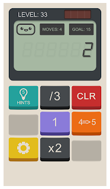
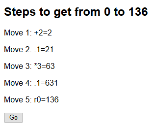

# Calculator Game Solver

The [calculator game][calcgame] is an Android game where you have a limited number and range of maths operations with which to change one number into another. The game's puzzles can be solved using a recursive solver, and that's what this is! **Warning** this will suck the fun out of the game for you :)

[calcgame]: https://play.google.com/store/apps/details?id=com.sm.calculateme

## How to use it

There isn't a proper UI, you have to change the values at the top of the `calc.js` file. E.g. to go with the screenshot above:

	var start = 2;
	var target = 15;
	var moves = 4;
	var ops = [
		o('/',3),
		o('.', 1),
		o(4, 5),
		o('*', 2)
	];

Operations are expressed like `o(operation, value)`. The operations are:

    * `+` Add
    * `-` Subtract
    * `*` Multiply
    * `/` Divide
    * `r` Reverse (the `value` is not used in this case)
    * `.` Concatenate (that is, fix the given `value` onto the end of the number string)
	* `1` (Or *any number*) Replace the first number with the second, so `o(4,5)` is replace 4s with 5s
	
**Not implemented**:

	* Bit shift (`<<` and `>>` in the game)
	
## Sample run

Input:

	var start = 0;
	var target = 136;
	var moves = 5;
	var ops = [
		o('.',1),
		o('+', 2),
		o('*', 3),
		o('r',0)
	];
	
Output:

## How it works

Given the very simple case:

var start = 1;
var target = 3;
var moves = 2;
var ops = [
    o('+',1),
    o('-', 1)
];

The recursive algorithm explores every possible tree of operations until it finds one that works. It takes one step closer (perhaps) to the solution of the problem and then calls itself with the new data:

 > To get from 1 to 3 in 2 moves, I will first apply a +1
 > To get from 2 to 3 in 1 move, I will first apply a +1
 > I did it! Unload the operations on the stack and print them out
 
## License

UNLICENSE - DON'T CARE
